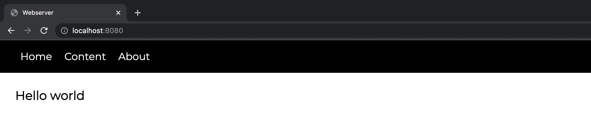
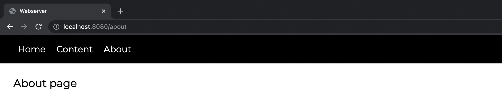
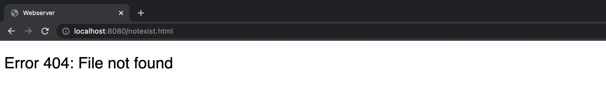

# Низкоуровневая работа с веб

Веб-сервер наследуется от многопоточного сервера, поэтому имеется функциональность подключения нескольких клиентов. Загрузка файлов и формирование ответа сервера реализовано в отдельном [файле](./responseLoader.py).

Подключение к главной странице.

Возможность переключаться между страницами. 

Обработка несуществующего файла. 

