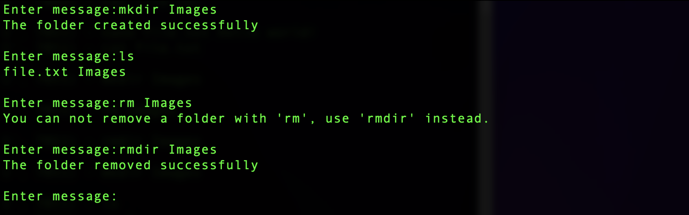

# FTP сервер

Реализованы все основные функции FTP сервера. Операции с файлами вынесены в отдельный [файл](./fileManager.py). [FTP сервер](./ftp_server.py) обрабатывает входящие запросы, возможна функция подключения нескольких клиентов, но таком случае работа будет производится с одной папкой.

---
## Примеры

Просмотр содержимого папки (команда ls). Чтение файла (cat). Изменение файла (nano). Вывод сообщения о статусе выполнения команд.

---

Создание папки, при попытке удалить папку командой для удаления файлов, выводится ошибка и подсказка по её устранению.

---

Переименование файлов командой rename. Создание файла без содержания (touch).

--- 

Пример с подключением нескольких клиентов. Операции производятся с одной папкой.

