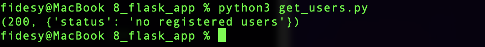
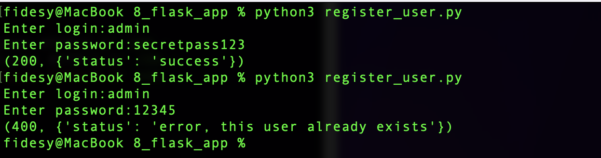
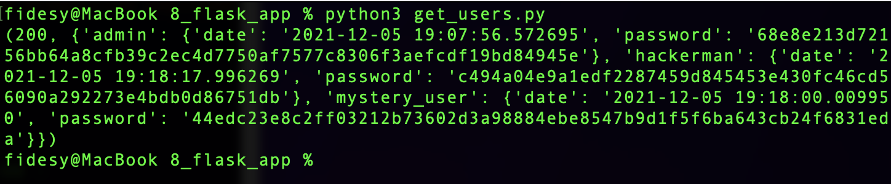

# Создание микросервиса

Сервис принимает GET и POST запросы. В файлах [get_users.py](get_users.py) и [register_user.py](register_user.py) содержатся примеры GET и POST запросов на сервис.

GET /user/ выводит список всех пользователей.

POST /user/ добавляет пользователя, данные для регистрации передаем в формате json.

---
## Примеры
Первоначальный запрос GET на сервис.
Получаем код ответа сервера (200) и тело в формате JSON, пока пользователей нет.

---

POST запрос на сервис. Вводим логин и пароль пользователя, получаем ответ JSON с информацией об успешности регистрации. При повторной попытке зарегистрировать пользователя с данным логином получаем ошибку - "такой пользователь уже существует". 

---

Добавим еще несколько пользователей и снова отправим GET запрос. В результате получаем JSON файл, содержащий логины, хэш паролей и даты регистрации пользователей. Данные о пользователях  храним в файле [json](users.json) (ключ-значение).

